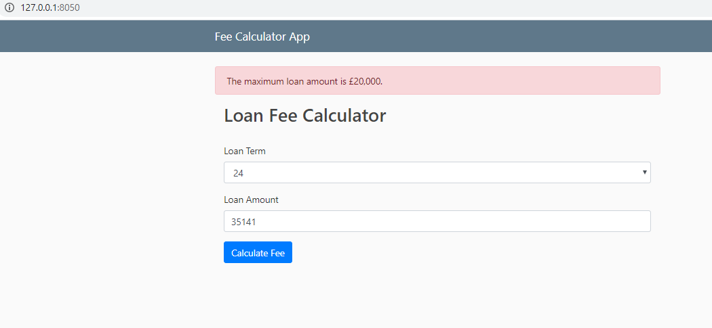
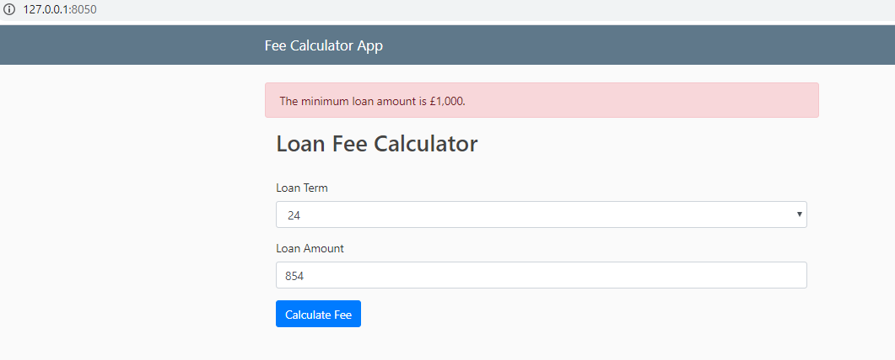

# A FeeCalculator wrapped in Flask micro-web framework






How to Install
````
# Create a virtualenv

# Install the `requirements.txt` file in the virtualenv

# Get the fee-calculator app
$ git clone https://github.com/waleadekoya/FeeCaculator.git

# Configure the app
$ update the `calculator_app_config.py` if required.

# Run the flask development server
$ `flask run` or `python wsgi.py`
$ Open the browser at: http://127.0.0.1:8050/
